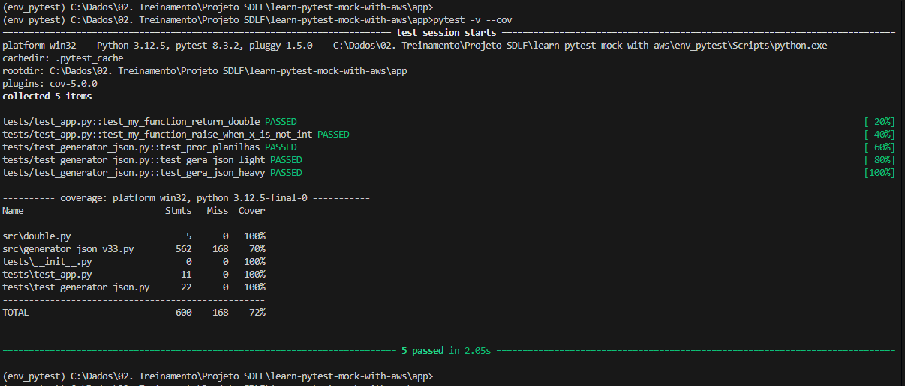

# Learn Pytest Mock with AWS
Este repositório é um guia prático para aprender a usar o Pytest junto com o Mock em ambientes AWS. Se você deseja escrever testes automatizados robustos e confiáveis para suas aplicações que utilizam serviços AWS, este é o lugar certo para começar.

## O que você encontrará aqui
* Tutoriais passo a passo sobre como usar Pytest para escrever testes unitários e de integração.
* Exemplos práticos de como aplicar mocks para simular chamadas a serviços AWS, como S3, DynamoDB, Lambda, e mais.
* Boas práticas para organizar e estruturar seus testes para garantir que sejam fáceis de manter e entender.
* Exercícios e desafios para ajudar a consolidar seu conhecimento.

## Pré-requisitos
Conhecimento básico em Python.
Familiaridade com os serviços AWS que deseja testar.
Instalação do Pytest e boto3.

## Comece agora
Siga os tutoriais, explore os exemplos e comece a testar suas aplicações AWS com confiança!

## Conteudo util e comandos
### Criar ambiente
python -m venv env_pytest

### iniciar ambiente (win32)
env_pytest\Scripts\activate

### Instala libs
pip install -r app/requirements.txt

### Executa pytest na pasta app
cd app
python -m pytest -v --cov

### Resultado do comando acima

terraform plan -var-file="./_variables/prd.tfvars"

## links:
https://docs.pytest.org/en/stable/
