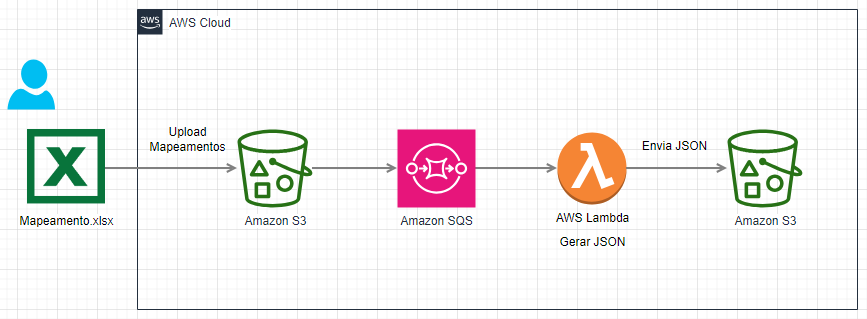

# Learn Pytest Mock with AWS
Este repositório é um guia prático para aprender a usar o Pytest junto com o Mock em ambientes AWS. Se você deseja escrever testes automatizados robustos e confiáveis para suas aplicações que utilizam serviços AWS, este é o lugar certo para começar.

Arquitetura que gera metadados em JSON com mapeamento em Excel

Essa arquitetura representa um fluxo de dados automatizado na AWS que converte um arquivo Excel (.xlsx) em um JSON e armazena os resultados em outro bucket S3. Abaixo estão os componentes do processo:

Usuário e Arquivo Excel: O processo começa com um usuário fazendo o upload de um arquivo Excel chamado "Mapeamento.xlsx". Este arquivo contém os dados a serem processados.

Amazon S3 (Upload de Mapementos): O arquivo Excel é carregado em um bucket S3, que serve como um repositório inicial para armazenar os dados brutos.

Amazon SQS (Fila de Mensagens): Após o upload do arquivo para o S3, uma mensagem é enviada para uma fila do Amazon SQS. Essa fila serve como um buffer para controlar e gerenciar as mensagens que indicam a chegada de novos arquivos para processamento. Ela garante que o processamento seja feito de maneira controlada e escalável, evitando sobrecargas no sistema.

AWS Lambda (Gerar JSON): Quando uma mensagem chega na fila SQS, uma função Lambda é acionada. Essa função lê o arquivo Excel armazenado no bucket S3, processa seus dados e os converte em um arquivo JSON.

Amazon S3 (Envio do JSON): O arquivo JSON gerado pela função Lambda é enviado de volta para outro bucket S3, onde fica armazenado para uso posterior, como análise ou integração com outras aplicações.

Essa arquitetura adiciona o componente de fila (SQS) para desacoplar o upload do processamento e melhorar a resiliência e escalabilidade do sistema.

## O que você encontrará aqui
* Tutoriais passo a passo sobre como usar Pytest para escrever testes unitários e de integração.
* Exemplos práticos de como aplicar mocks para simular chamadas a serviços AWS, como S3, DynamoDB, Lambda, e mais.
* Boas práticas para organizar e estruturar seus testes para garantir que sejam fáceis de manter e entender.
* Exercícios e desafios para ajudar a consolidar seu conhecimento.

## Pré-requisitos
Conhecimento básico em Python.
Familiaridade com os serviços AWS que deseja testar.
Instalação do Pytest e boto3.

## Comece agora
Siga os tutoriais, explore os exemplos e comece a testar suas aplicações AWS com confiança!

## Conteudo util e comandos
### Criar ambiente
python -m venv env_pytest

### iniciar ambiente (win32)
env_pytest\Scripts\activate

### Instala libs
pip install -r app/requirements.txt

### Executa pytest na pasta app
cd app
python -m pytest -v --cov

### Resultado do comando acima

## COMANDOS
terraform apply -auto-approve -var-file="./_variables/prd.tfvars"
terraform plan -var-file="./_variables/prd.tfvars"
terraform destroy -auto-approve -var-file="./_variables/prd.tfvars"

## links:
https://docs.pytest.org/en/stable/ 
